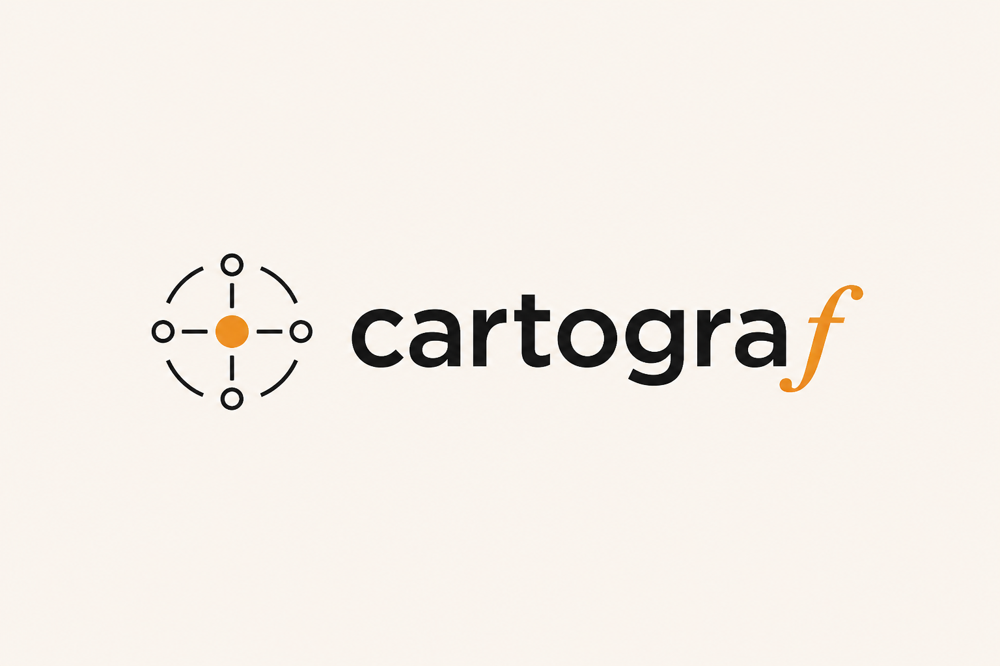

<p align="center">
  
</p>

# cartograf

**A visual map of what your projects are wired to.**

cartograf turns a JavaScript or TypeScript project's `package.json` into an interactive, radial map of its libraries, services, databases, auth providers, payment tools, deployment targets, and more. Each project is a compass; its detected technologies orbit the hub, grouped by category.

[Try cartograf Cloud](https://www.cartograf.dev/app)

## Why cartograf?

Projects rarely stay simple. A dependency list can tell you that a package is installed, but it does not make it easy to see the larger picture: which external services a project relies on, where an account still needs to be created, or which tools are shared across your work.

cartograf makes those connections visible. It gives you a quick way to orient yourself in an unfamiliar repository, document a stack for a teammate, and spot the services behind a project before you start changing it.

## What it does

Point cartograf at a public GitHub repo, a local folder, or a `package.json` file. It reads the manifest, samples JavaScript/TypeScript source usage, and builds a map from a curated technology catalogue.

- See recognized libraries and services grouped by category instead of in one long dependency list.
- Label the accounts behind a service and see what still needs wiring up.
- Keep multiple projects open together on a zoomable canvas to understand your wider stack.
- Run it locally with no account or database: workspace data stays in your browser.

The OSS app has no account system and no server database. Workspace data stays in browser storage unless you export it yourself.

## Getting started

```bash
pnpm install
pnpm dev
```

Open [http://localhost:3000/app](http://localhost:3000/app).

No environment variables are required for local use.

## Scanning a project

**GitHub URL** - paste any public repo URL directly into the input field. cartograf fetches the root `package.json`, samples a bounded set of source/config files through the GitHub API, and builds the map.

**Local folder** - click "Open folder" and select a directory from your machine (Chrome/Edge only - requires the File System Access API). cartograf looks for a `package.json`, then scans within fixed file and size limits.

**Manual** - drop a `package.json` onto the canvas.

## Accuracy and limits

cartograf is a best-effort stack map, not an exhaustive software inventory.

- Detection is based on a curated technology catalogue, package names, deployment config files, scripts, and JavaScript/TypeScript import patterns.
- GitHub scans intentionally inspect bounded repository data: the root `package.json`, deployment config paths, and a sample of eligible source files.
- Local folder scans run in the browser with fixed file-count, source-file, and file-size limits.
- Monorepos are treated conservatively: cartograf chooses the shallowest `package.json` instead of recursively building every workspace package.
- Browser uploads are capped before parsing: `package.json` uploads must be under 1 MB and cartograf JSON imports under 5 MB.

These limits keep scans fast, predictable, and safer for public/self-hosted deployments. Missing detections should be treated as expected product limitations rather than proof that a technology is absent.

## Supported manifests

| File | Ecosystem |
|---|---|
| `package.json` | Node / JavaScript |

## Self-hosting

Set `NEXT_PUBLIC_APP_URL` to your domain when deploying publicly so sitemap and OG tags resolve correctly.

```bash
pnpm build
pnpm start
```

If you expose a self-hosted instance to the public internet, put it behind your platform's normal edge protections or WAF. The app includes a best-effort `/api/stack` throttle, but it is per-process and not a substitute for infrastructure rate limiting.

By default the OSS throttle does not trust `x-forwarded-for` or `x-real-ip`, because a directly exposed server can receive forged header values. Set `CARTOGRAF_TRUST_PROXY_HEADERS=true` only when the app sits behind a proxy you control that overwrites those headers.

## License

AGPL-3.0 - see [LICENSE](LICENSE).
